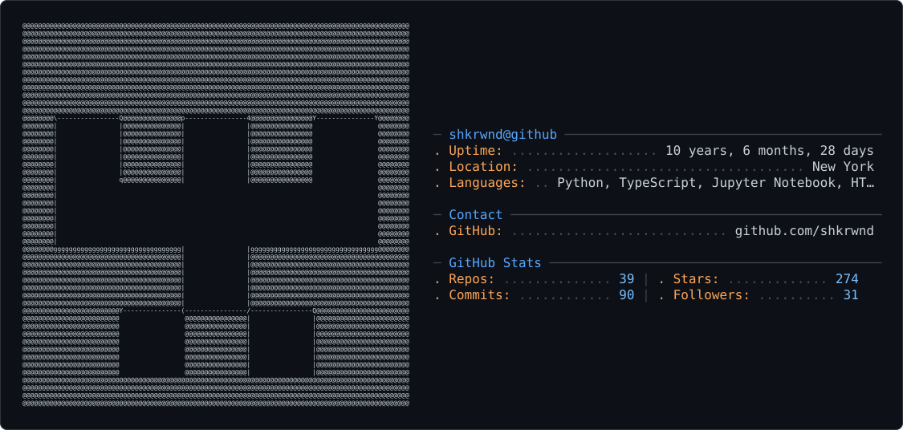

<picture>
  <source media="(prefers-color-scheme: dark)" srcset="dark_mode.svg" />
  <source media="(prefers-color-scheme: light)" srcset="light_mode.svg" />
  
</picture>

# 👋 Hi, I'm Shikhar Tiwari

**Senior Software Engineer** | AI Systems | Distributed Architectures

---

## 🚀 About

7+ years building scalable, production-grade systems. Expert in AI/ML systems, distributed architectures, backend APIs, and real-time data processing.

**Core Skills:** Python, TypeScript, Java, Go | FastAPI, Spring Boot, React | PostgreSQL, Neo4j, Redis | AWS, GCP, Kubernetes

